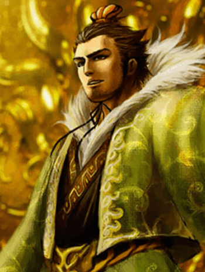
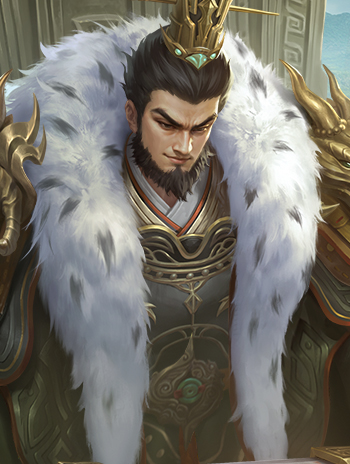

# 孙权

界孙权

---

## 基本信息

- **势力**：吴
- **体力**：   
- **性别**：男  
- **区服**：OL、十周年

---

## 技能

制衡

<strong>普通技</strong>，出牌阶段，你可以blabla。

救援

<strong>主公技</strong>，blabla。

---

## FAQ

---

威孙权

---

## 基本信息

- **势力**：吴
- **体力**：   
- **性别**：男  
- **区服**：十周年

---

## 技能

斡衡

<strong>普通技</strong>，出牌阶段，你可以blabla。

御麾

<strong>普通技</strong>，结束阶段，blabla。

---

## FAQ

